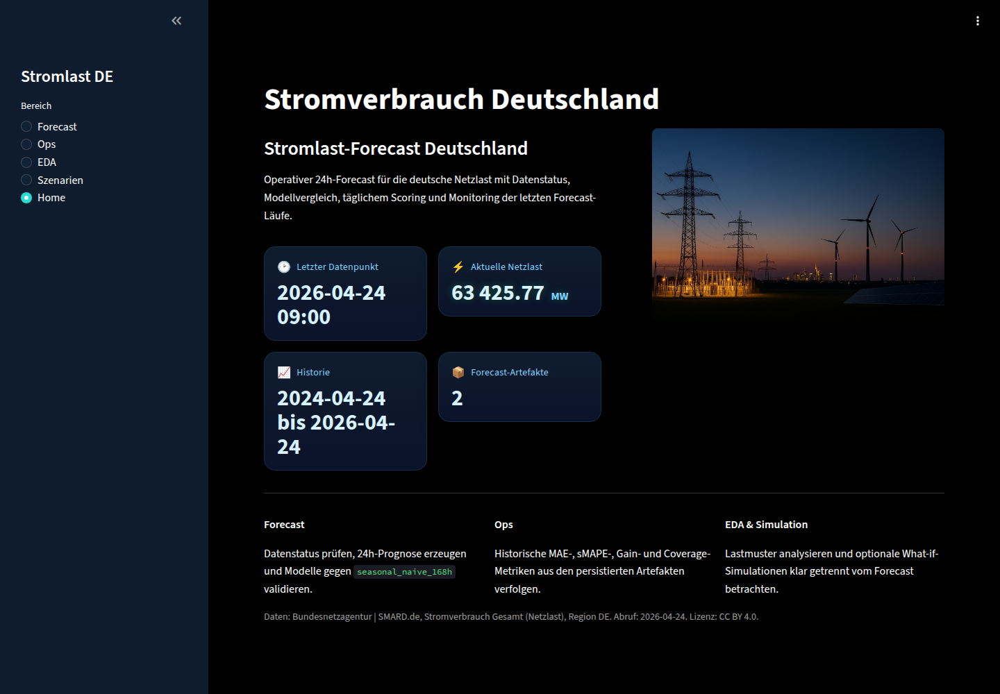
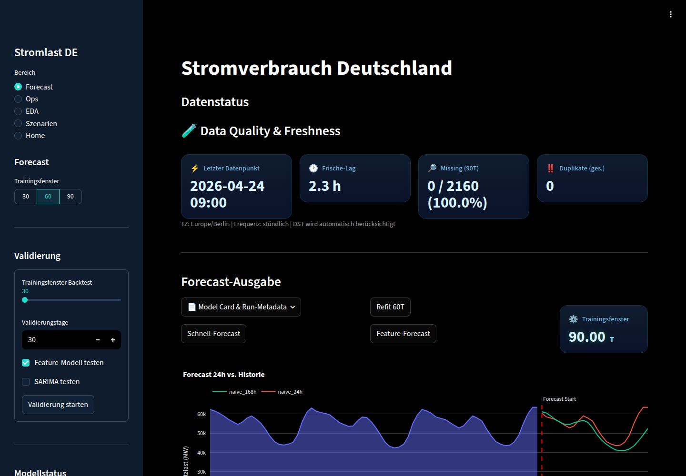
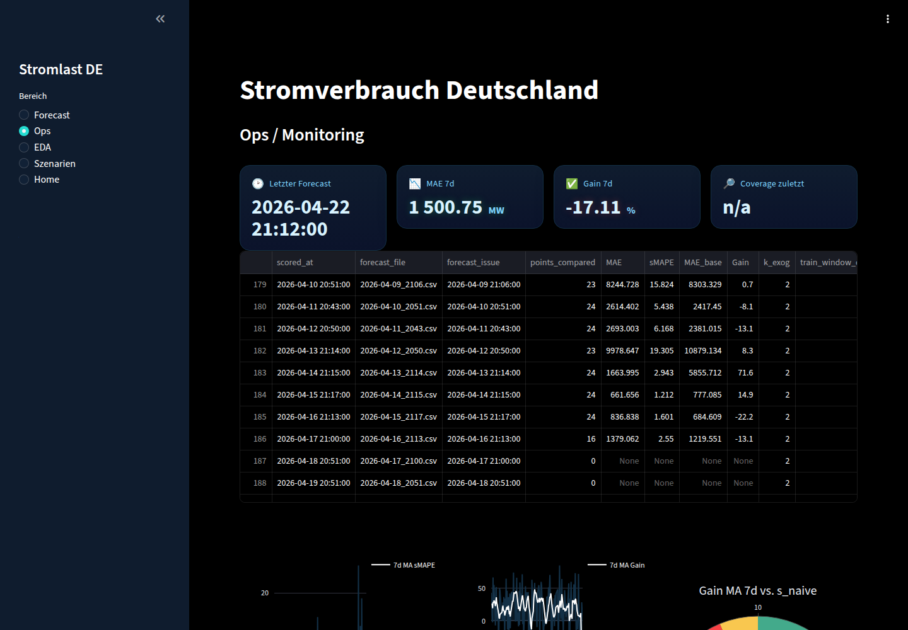

# Stromlast-Forecast DE

Streamlit-App fuer einen operativen 24h-Forecast der deutschen Netzlast. Die App verbindet SMARD-Datenabruf, Datenqualitaetspruefung, Modellvergleich, Forecast-Ausgabe und Monitoring in einer schlanken Oberflaeche.

Der fachliche Fokus liegt auf nachvollziehbarer Kurzfristprognose: Baselines bleiben die Referenz, SARIMA und ein feature-basiertes Modell treten gegen `seasonal_naive_168h` an, und Forecast-Artefakte werden taeglich bewertet.

## Features

- **Forecast-Ansicht**: Datenstatus, 24h-Forecast, Modellstatus und Validierung in einem operativen Workflow.
- **Modellvergleich**: `naive_last_hour`, `seasonal_naive_24h`, `seasonal_naive_168h`, SARIMA+Kalenderfeatures und Random-Forest mit Lag-/Kalenderfeatures.
- **Backtesting**: Rolling-Origin-Folds mit `H=24`, 24h-Schritt und Coverage-Pruefung.
- **Metriken**: `MAE`, `sMAPE`, `MASE_168h`, Baseline-Gain gegen `seasonal_naive_168h`.
- **Prediction Intervals**: Coverage, mittlere Intervallbreite und Kalibrierungsfehler im gemeinsamen Scoring.
- **Ops / Monitoring**: historische Forecast-Laeufe, 7-Tage-KPIs, Gain/sMAPE-Verlauf, Intervallmetriken und Forecast-Artefakte.
- **EDA**: Zeitraumfilter, Feiertags-Overlay, Vorjahresvergleich, Wochenprofil, Wochentage und Monatsmuster.
- **Szenario-Simulation**: optionale What-if-Presets auf Historie, klar getrennt vom Forecast.

## Screenshots







## Projektstruktur

```text
app.py                    # Streamlit-Einstiegspunkt
metrics_job.py            # Daily Forecast/Scoring Job
src/power_forecast/
  charts.py               # Plotly-Charts fuer EDA
  config.py               # Pfade und zentrale Settings
  data_quality.py         # Datenqualitaets-Kennzahlen
  evaluation.py           # Metriken, Folds und gemeinsames Scoring
  feature_model.py        # Random-Forest-Kandidat mit Lag-/Kalenderfeatures
  features.py             # Kalender-, Lag- und Rolling-Feature-Pipeline
  forecast.py             # Baselines, SARIMA, Model Card, Forecast-Wrapper
  scenarios.py            # What-if-Transformationen
  smard_data.py           # SMARD-Datenzugriff
  ui_components.py        # Streamlit-Komponenten
tests/                    # Tests fuer Kernlogik, Scoring, Features, Szenarien
artifacts/                # Persistierte Forecast-, Modell- und Metrikartefakte
```

## Schnellstart

```bash
python -m venv .venv
.venv/bin/python -m pip install -r requirements.txt -r requirements-dev.txt
.venv/bin/python -m streamlit run app.py
```

Dann oeffnen:

```text
http://localhost:8501
```

Alternativ mit Docker Compose:

```bash
docker compose up --build
```

## Tests

```bash
.venv/bin/python -m pytest
```

Die Tests laufen ohne Netzwerkzugriff. SMARD-spezifische Tests verwenden Mocks.

## Modelle und Validierung

Die App nutzt eine gemeinsame Backtesting- und Scoring-Logik fuer Baselines, SARIMA, Feature-Modell und Daily-Metrics-Job.

- Forecast-Horizont: `24h`
- Fold-Schritt: `24h`
- Trainingsfenster: konfigurierbar
- Mindest-Coverage pro Fold: `80%`
- Primaere Referenz: `seasonal_naive_168h`

Das feature-basierte Modell nutzt:

- Kalenderfeatures: Stunde, Wochentag, Monat, Wochenende, Feiertag
- Lag-Features: `t-24`, `t-48`, `t-168`
- Rolling Means: `24h`, `168h`

## Szenarien

Die Szenarien sind Simulationen auf historischen Lastdaten, keine Forecasts. Sie dienen zur schnellen What-if-Analyse:

- Feiertag / Wochenende
- Demand Response
- Effizienztrend
- Wetterstress
- Netto-Last mit synthetischem PV-/Wind-Abzug
- Event-Tage

Fuer produktive Forecast-Verbesserungen ist ein Forecast-Erklaerungs- und Anomaliepanel der naechste sinnvollere Ausbau als weitere Szenario-Logik.

## Daten und Lizenz

- Quelle: Bundesnetzagentur | SMARD.de
- Bereich: Stromverbrauch Gesamt (Netzlast), Region DE, stuendliche Aufloesung
- Datenlizenz: Creative Commons CC BY 4.0
- Code: MIT, siehe [LICENSE](LICENSE)
