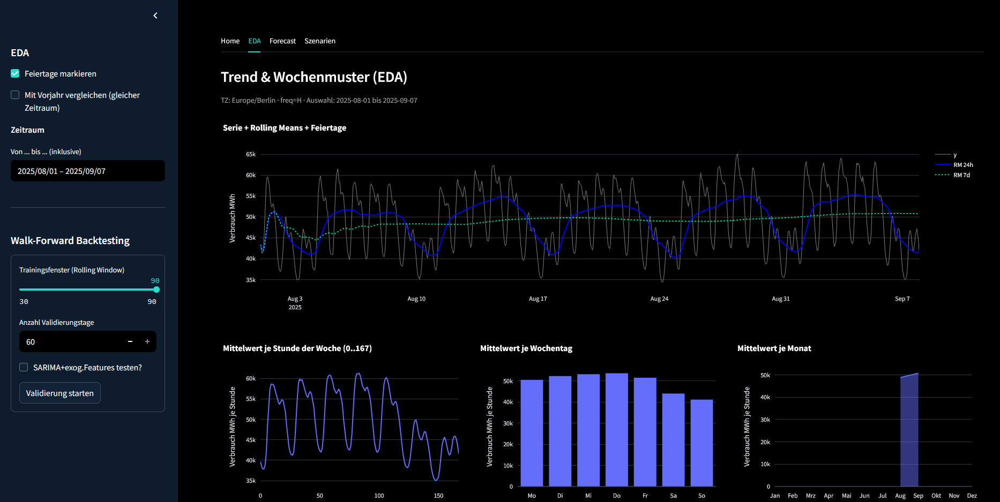
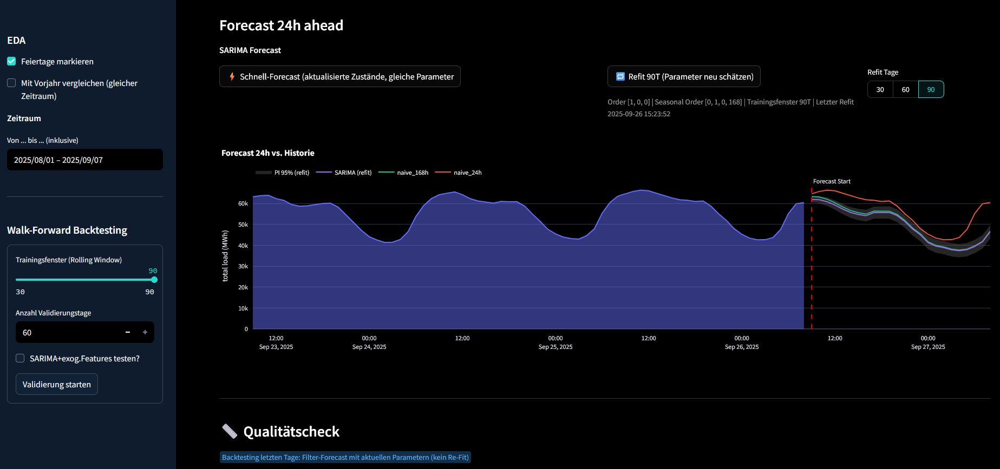
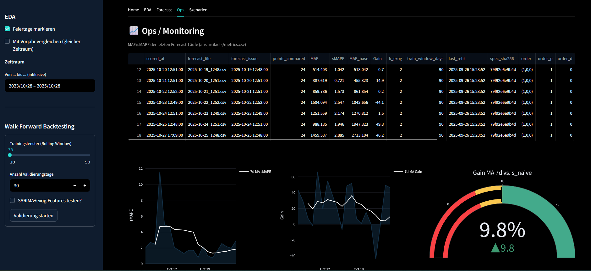

# Stromlast‑Forecast DE
> Dieses Projekt prognostiziert die stündliche Stromlast 
(Kurzfrist-Horizon: 24 h). Ziel ist, Day-Ahead/Intraday-Mengen verlässlicher zu planen und Transparenz über Prognoseunsicherheit zu schaffen. Die Lösung kombiniert einfache Baselines (seasonal-naive) mit einem SARIMA-Modell, 
 bewertet täglich per MAE/sMAPE und Promotion-Gate (Vorteil ggü. Baseline), 
 speichert Artefakte reproduzierbar und überwacht die 
 Modellgüte im Ops-Tab.

## ✨ Features

- **EDA**: Zeitraumwahl, Feiertags‑Overlay, optional Vorjahresvergleich; Linien‑ & Wochenmusterplots.
- **Baselines & Backtesting**: Naive / Seasonal‑Naive (m=24/168) / Drift; Walk‑Forward mit fixem Horizont.
- **Metriken**: **MAE**, **sMAPE**, **MASE (168h)**.
- **SARIMA (+exogene Kalender‑Features)**: optional.
- **Daily-Metrics-Job**: Forecasting und Scoring via Github-Actions, Monitoring Modell-Metriken 
- **What‑if Szenarien** (Post‑Processing):
  - Feiertag/Weekend‑Multiplikator,
  - Peak→Off‑Peak‑Verschiebung (Demand Response),
  - Temperatur‑Sensitivity (linear),
  - Effizienz‑/Spar‑Trend (ab Datum),
  - Event‑Tage (±%),
- **KPI‑Cards**: Δ Peak (MW), Δ Energie (MWh) für Szenarien.

---

## 🖼️ Einblicke








---
## 🗂️ Projektstruktur

```
app.py                    # Streamlit-Einstiegspunkt
metrics_job.py            # Daily Forecast/Scoring Job
src/power_forecast/       # kompakter App-Kern
  forecast.py             # Baselines, Walk-Forward, Metriken, SARIMA
  smard_data.py           # Daten-Loader fuer SMARD
  data_quality.py         # Datenqualitaets-Kennzahlen
  scenarios.py            # What-if-Transformationen
  ui_components.py        # Streamlit-Komponenten
tests/                    # Tests fuer Kernlogik und SMARD-Parsing

```
---
## ▶️ Anwendung

**Voraussetzungen**

- Docker Desktop (Windows/macOS) oder Docker Engine (Linux)
- Port 8501 ist frei

**Repo holen**

- git clone https://github.com/Franky-11/electricity_load.git
- cd electricity_load

**Schnellstart mit Docker Compose** 

```
docker compose up --build
```
- Öffne: http://localhost:8501
- Persistenz: Modelle/Validierungen werden im Host-Ordner ./artifacts gespeichert (und beim Neustart wieder genutzt).

---

## 🧠 Modelle & Metriken

**Baselines:**
- `naive` → $\hat{y}_{t+h} = y_t$
- `seasonal_naive(m)`→ $\hat{y}_{t+h} = y_{t+h-m}$
- **SARIMA** (optional):  order (1,0,0) x seasonal_order (0,1,0,168) ; exog: Wochenende/Feiertag.
- **Metriken:**
  - **MAE** 
  - **sMAPE** 
  - **MASE‑168h** 


---

## 🧪 What‑if‑Szenarien (Post‑Processing)

Szenarien ändern **Historie** nachträglich:

- **Holiday/Weekend‑Multiplikator**: skaliert nur diese Tage.
- **Load‑Shift**: verschiebt x% von Peak‑ in Off‑Peak‑Stunden (Energieerhaltung pro Tag).
- **Temperatur‑Sensitivity**: ±% je °C Abweichung (linear, synthetisch).
- **Effizienz‑Trend**: ab Datum pro Jahr ±r% (multiplikativ).
- **Event‑Tage**: Liste von Datumswerten ±%.


> **Interpretation:** Δ‑KPIs zeigen **Peak‑Reduktion** (MW) & **Energie‑Δ** (MWh). Ergebnisse sind **Simulationen**, keine Prognosen.

---

## 📜 Lizenz
Code: MIT – siehe LICENSE.

Datensatz:
- **Quelle:** SMARD – Strommarktdaten der Bundesnetzagentur, Bereich *Stromverbrauch: Gesamt (Netzlast)*, Region **DE**, Auflösung **Stunde**.  
- **Lizenz:** **Creative Commons CC BY 4.0** 
- **Empfohlene Attribution:** **„Bundesnetzagentur | SMARD.de“**.  


